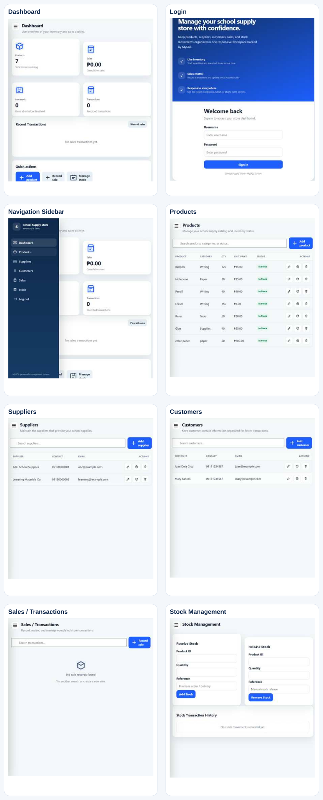

# School Supply Store Inventory and Sales Management System

A small CRUD-shaped system for managing school-supply products, suppliers, customers, inventory transactions, and sales.

## Week 1 — Project Scaffolding

### Problem statement

The school supply store needs a simple way to keep its inventory records organized because supplies, stock quantities, suppliers, customers, and sales can become difficult to track consistently using manual records. The proposed School Supply Store Inventory and Sales Management System will provide a centralized application where authorized users can create, view, update, and delete supply records, monitor stock levels, manage suppliers and customers, and record sales transactions. The project is intentionally scoped to a small CRUD-based system that can be developed and tested within the course schedule.

### Main record types

1. **Products / School Supplies** — item name, category, quantity, unit price, status, and supplier.
2. **Suppliers** — supplier name and contact information.
3. **Customers** — customer name and contact information.
4. **Sales / Transactions** — customer, items purchased, quantities, prices, total, and transaction date.

### Project stack

- Node.js
- Express
- MySQL 8+
- GitHub
- REST API

### Team roster

| Member | GitHub username | Starting role |
|---|---|---|
| Jhaira Nontiagudo | jhairamonteagudo597-eng | Repo Lead |
| Regine Casida | casidaregine123-byte | Board Lead |
| Alex Aclaracion | aaclaracionjr-prog | Scribe |
| Jendylou Lapad | GitHub username not verified | Builder |
| Lyndel | lyndeloulapad-design | Builder |


### Git collaboration loop

`pull main → create branch → commit → push branch → open PR → review → merge`

Direct pushes to `main` should be blocked after branch protection is configured.

### Week 1 deliverables

- [x] Project selected
- [x] Problem statement documented
- [x] 4 core record types documented
- [x] Git repository initialized
- [x] Week 1 documentation added through a branch
- [x] Verify all 5 team members are represented in the repository roster
- [ ] Enable and test main branch protection
- [ ] Create/verify the GitHub Project board
- [x] Replace repository ownership placeholders with named GitHub usernames
- [ ] Record review evidence for the Week 1 PR


See `docs/week1/` for the Week 1 problem statement, AI brainstorming note, and board setup checklist.


## Week 2 — Backlog & Wireframes

Week 2 deliverables are documented in:

- `docs/backlog.md` — 20 CRUD user stories covering Products, Suppliers, Customers, and Sales/Transactions, with acceptance criteria.
- `docs/wireframes/` — low-fidelity wireframes for list, detail, create, edit, empty, error, and delete-confirmation states for each record type.
- `docs/ai-notes/deliverable-1.md` — AI scope stress-test prompt, findings, and team decision.

The Week 2 handout requires every story to be an owned board ticket, every story to have acceptance criteria, and the wireframes to be committed through a reviewed pull request.


## Week 3 — Routing Skeleton

- `docs/routes.md` — complete 20-route REST routing table and request/response examples.
- `docs/week3.md` — Week 3 implementation and testing checklist.

## Deliverable 2 — Routing, Logic & Tests

### Test command

```bash
npm install
npm test
```

The test suite uses Node's built-in test runner with Supertest and runs serially where needed by shared database integration tests.

### Deliverable 2 evidence

- `docs/routes.md` — REST routing table
- `docs/validation.md` — validation rules and standardized 422 behavior
- `tests/deliverable-2.test.js` — CRUD, business logic, validation, and edge-case integration tests
- `tests/validation.test.js` — validation guard-clause tests
- `docs/ai-notes/deliverable-2.md` — instructor-authorized AI-use statement

## Week 4 — Input Validation & Defensive Coding

- `docs/week4.md` — Week 4 defensive-coding implementation notes and break-the-app checklist.
- `docs/validation-matrix.md` — field-by-field validation matrix and expected HTTP responses.
- `tests/week4-validation.test.js` — deliberate bad-input tests covering guard clauses and protected actions.
- `docs/ai-notes/week4.md` — instructor-authorized AI-use statement.


## Week 6 — Views & Component Architecture

- `docs/components.md` — reusable components mapped to the Week 6 screens.
- `docs/week6.md` — Week 6 implementation notes and local run instructions.
- `docs/ai-notes/week-06.md` — required AI prompt log and ownership labels.
- `public/ui/` — static Dashboard, Products, Suppliers, Customers, and Sales views.
- `public/css/styles.css` and `public/js/components.js` — shared interface structure.

Run `npm start` and open `/ui/` to review the Week 6 views. Real backend data binding is intentionally deferred to Week 7.

## Week 7 — Form Binding & Async Operations

- `docs/week7.md` — Week 7 implementation notes.
- `docs/binding-tests.md` — end-to-end binding test checklist and execution note.
- `docs/ai-notes/week-07.md` — required AI prompt log with ownership labels.
- `public/ui/js/forms.js` — Fetch-based Create/Update binding and async lifecycle handling.
- `public/ui/js/list.js` — backend-backed list rendering with loading/empty/error states.

The Week 7 UI connects the existing Phase 2 controllers to the Week 6 forms. Real browser/database test execution should be completed locally before merge.

## Week 8 — Error Handling & User Feedback

- `docs/week8.md` — Week 8 implementation notes and Deliverable 3 status.
- `docs/week8-tests.md` — deliberate failure-path test matrix.
- `docs/ai-notes/week-08.md` — required AI prompt log.
- `public/ui/js/feedback.js` — shared loading/success/error feedback helper.
- `public/ui/login.html` — sign-in UI for obtaining the existing Bearer token used by protected actions.

Week 8 extends the Week 7 Fetch interface so loading, success, validation, not-found, server, authorization, and network failures are visible and human-readable. Destructive actions require confirmation.


## MySQL Database — Current Application

The application is backed by MySQL 8+. The Node.js application uses the mysql2 Promise API with a connection pool, parameterized SQL statements, and database transactions for inventory-changing operations.

### Local setup

1. Install Node.js 20+ and MySQL 8+.
2. Copy .env.example to .env and set DB_HOST, DB_PORT, DB_NAME, DB_USER, and DB_PASSWORD.
3. Create the database with `CREATE DATABASE school_supply_store;` and run `database/schema.sql`. The application will create missing tables automatically.
4. Run:

```bash
npm install
npm start
```

5. Open http://localhost:3000/ui/.

Demo accounts:
- Admin: `admin` / `admin123`
- Staff: `staff` / `staff123`

### Main API

- `POST /auth/login`
- `GET /dashboard`
- `GET/POST/PUT/DELETE /products`
- `GET/POST/PUT/DELETE /suppliers`
- `GET/POST/PUT/DELETE /customers`
- `GET/POST/PUT/DELETE /sales`
- `POST /stock/in`
- `POST /stock/out`
- `GET /stock/transactions`
- `GET /reports/inventory`
- `GET /reports/sales`
- `GET /reports/low-stock`
- `GET /reports/transactions`

### Inventory behavior

Creating a sale calculates totals from current product prices and decreases inventory. Editing a sale restores the previous quantities before applying the replacement transaction. Deleting a sale restores its inventory. Manual stock-in and stock-out actions also create stock transaction records.

### Tests

CI starts a MySQL 8 service and runs:

```bash
npm install
npm test
```

npm install is intentionally used in CI so package.json and package-lock.json can be reconciled after the database-driver migration.

### Database files

- `database/schema.sql` — repeatable MySQL schema and demo seed data.
- `.env.example` — local MySQL configuration template.
## Current Deployment

- Production host: Railway
- Public application: https://school-supply-store-inventory-and-sales-management-production.up.railway.app/ui/
- Production database: Railway MySQL

See `docs/deployment.md` for deployment notes.

## Week 12 — Retrospective, Demo & Defense

Week 12 is the final submission stage.

- docs/retrospective.md — structured retrospective with repository-verified observations and a team discussion record.
- docs/week12-demo-script.md — presentation arc, live-demo click path, graceful failure, backup demo, and presenter assignments.
- docs/deliverable-4.md — final submission checklist separating repository evidence from human-only evidence.
- docs/manual-evidence-record.md — template for recording actual local or Railway browser test results.

The final presentation should follow problem → solution → architecture → live demo → what we learned. The live demo should use the deployed Railway application. Each member must complete their own oral code defense without AI.


## UI Screenshots

The current responsive interface is shown below.


